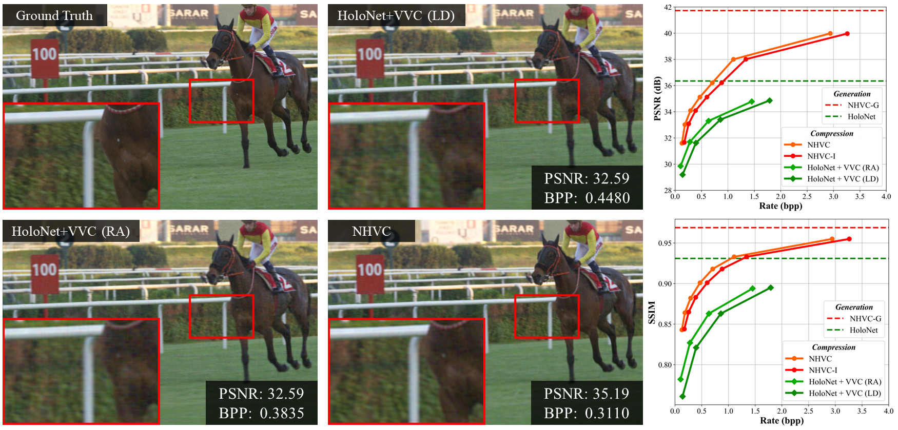

# NHVC: Neural Holographic Video Compression with Scalable Architecture,<br> IEEE VR 2024
This repository contains the source codes of the paper **[NHVC: Neural Holographic Video Compression with Scalable Architecture](https://ieeexplore.ieee.org/abstract/document/10494082)**  
**Hyunmin Ban**, Seungmi Choi, Jun Yeong Cha, Yeongwoong Kim and **[Hui Yong Kim](https://vmlab.khu.ac.kr)**  



We introduce an end-to-end trainable neural network-based phase hologram generation and video compression model named Neural Holographic Video Compression (NHVC). NHVC model can generate phase hologram with high quality (33.6dB in PSNR) reconstruction in real-time (30fps) with the [DIV2K dataset](https://openaccess.thecvf.com/content_cvpr_2017_workshops/w12/html/Agustsson_NTIRE_2017_Challenge_CVPR_2017_paper.html). For compression tasks, our model achieved 65.9% BD-Rate reduction against [DPRC](https://dl.acm.org/doi/10.1145/3528223.3530070) for phase hologram image compression and significantly outperformed ‘[HoloNet](https://www.computationalimaging.org/publications/neuralholography/) + [VVC](https://ieeexplore.ieee.org/abstract/document/9503377)’ by 75.6% BD-Rate reduction for phase hologram video compression with the [UVG dataset](https://ultravideo.fi/dataset.html).


## Getting Started
Our code uses PyTorch Lightning and PyTorch.  
You can set up a conda environment with the required dependencies using:
```bash
conda install --file requirements.txt
```

To train the model, we used the [DIV2K train dataset](https://data.vision.ee.ethz.ch/cvl/DIV2K/) for phase hologram image generation and compression, and the [VideoSet dataset](https://www.sciencedirect.com/science/article/pii/S1047320317300950) for phase video compression. 

```bash
# Train stage1: phase hologram generation
python train.py --train --data_path ./data/DIV2K --channel g --stage_mode stage1

# Train stage2: phase hologram image compression
python train.py --train --data_path ./data/DIV2K --channel g --stage_mode stage2 --lmbda 130

# Train stage3: phase hologram video compression
python train.py --train --video_path ./data/VideoSet --channel g --stage_mode stage3
```

To test the model, we used the [DIV2K valid dataset](https://data.vision.ee.ethz.ch/cvl/DIV2K/) and [UVG dataset](https://ultravideo.fi/dataset.html).
We release the our [model checkpoint](https://drive.google.com/drive/folders/1-8dk7wb_V7ag7FTBg71VbVoXBFZayXZ4)  which you can download.

## Parameters
The `config.py` file contains several parameters that influence different stages of the process. Below is a detailed explanation of each parameter and its usage:

1. `--stage_mode`:  
**Description**: Specifies the mode of operation.  
**Usage**: phase hologram generation, image_compression, video_compression

2. `--gain`:  
**Description**: Determines whether to use gain mode.  
**Usage**: Set to True to enable gain mode or False to disable it.

3. `--gain_mode`:  
**Description**: Specifies the level of gain when gain is enabled.  
**Usage**: Choose from low, mid, or high.

4. `--lmbda`:  
**Description**: Controls the rate-distortion parameter when gain is not used.  
**Usage**: Set the lambda value as needed. (e.g. 130, 2000)

5. `--level`:  
**Description**: Sets the per rate points when testing video compression.

6. `--eval_s`:  
**Description**: Sets the per rate point to evaluate the reconstruction after generating phase patterns.

## Citation
```
@inproceedings{ban2024nhvc,
  title={NHVC: Neural Holographic Video Compression with Scalable Architecture},
  author={Ban, Hyunmin and Choi, Seungmi and Cha, Jun Yeong and Kim, Yeongwoong and Kim, Hui Yong},
  booktitle={2024 IEEE Conference Virtual Reality and 3D User Interfaces (VR)},
  pages={969--978},
  year={2024},
  organization={IEEE}
}
```

## Contact
If you have any questions, please email Hyunmin Ban at <hmban1996@naver.com>.
